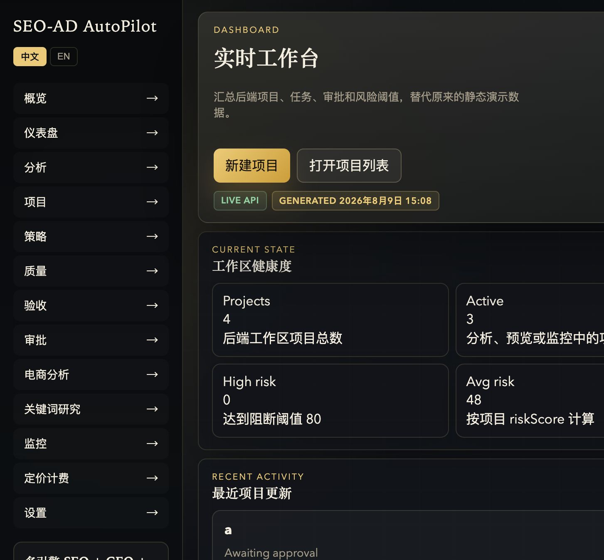
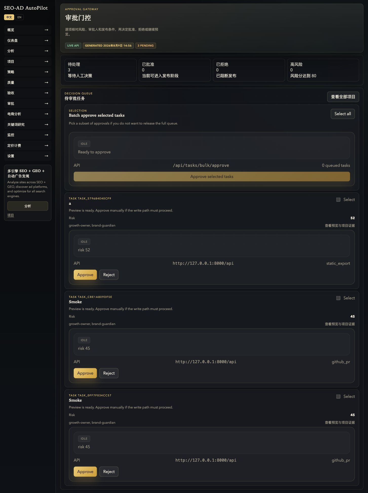
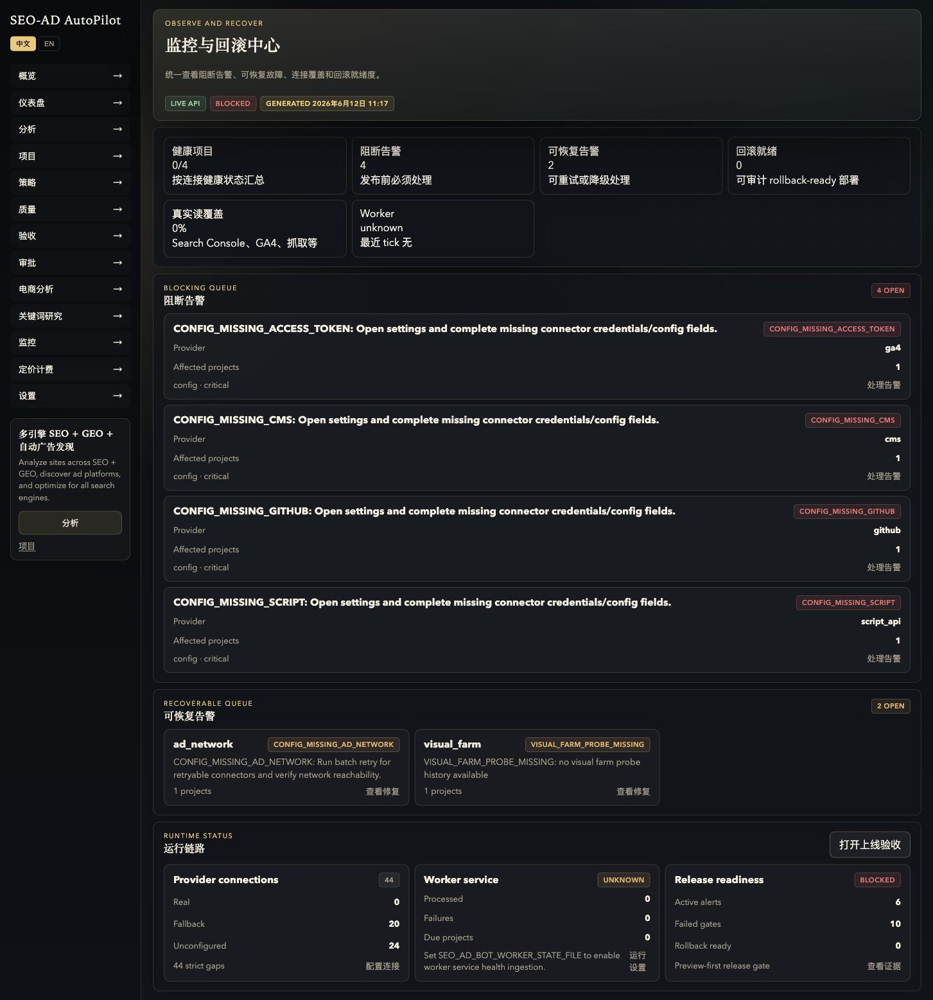
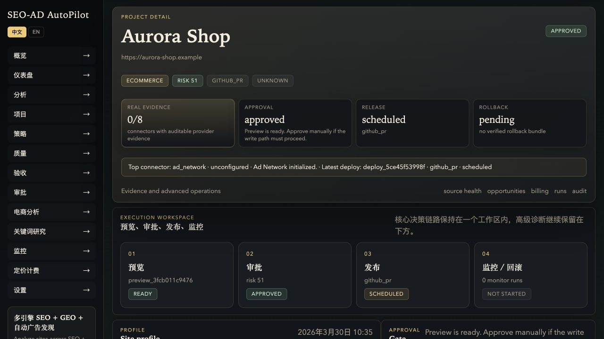
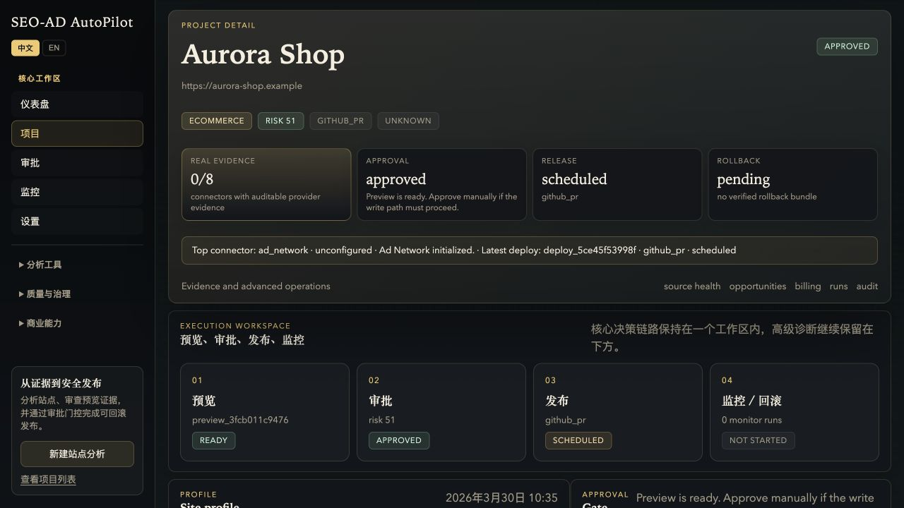
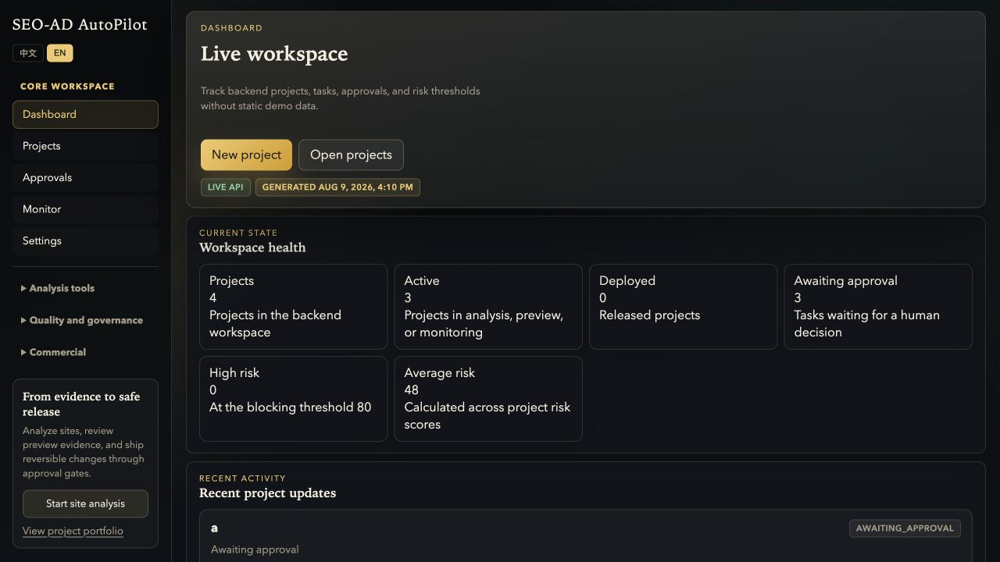

# SEO-AD AutoPilot 项目需求符合性与产品审查

审查日期：2026-08-09

## 1. 审查结论

当前项目已经具备 SEO-AD AutoPilot 的主要领域模型、分析工作流、审批状态机、部署适配层、回滚模型、巡航/队列、告警和控制台骨架。它已超过“静态原型”，但还没有达到原始设计所要求的生产闭环，也不能按“功能接口存在”判定为全部完成。

核心判断：**MVP 代码覆盖较高，生产证据覆盖不足；产品宽度过大，关键任务深度不足。**

- `docs/requirements-coverage.md` 当前记录 35 项已完成、21 项部分完成、0 项未完成。这里的“部分完成”包含外部真实接入、生产截图、真实写回、运行时编排和商业结算等关键阻断项。
- 运行中的验收页面显示 24 个 gate 中 10 个失败，真实读取证据 0、真实写回证据 0、回滚就绪样例 0。
- 当前后端主应用已有 181 个 API 路由、前端有 15 个页面。功能面已经扩展到结算网关、边缘流量、模型网关和大量告警厂商，但 Approval/Monitor 两个核心页面在本轮审查前仍是静态占位。
- 因此项目当前更接近“功能丰富的 Beta 控制平面”，而不是“已经完成生产验收的增长执行系统”。

## 2. 原始需求基线

审查基线来自以下文档：

- `SEO-AD_AutoPilot_文档包/SEO-AD_AutoPilot_PRD_v1.docx`
- `SEO-AD_AutoPilot_文档包/SEO-AD_AutoPilot_技术架构说明书_v1.docx`
- `SEO-AD_AutoPilot_文档包/SEO-AD_AutoPilot_MVP开发任务清单_v1.docx`
- `SEO-AD_AutoPilot_文档包/seo_ad_growth_platform_full_document.docx`

四份文档对产品目标的共同约束是：

1. 产品不是报告工具，而是 `分析 -> 策略 -> 预览 -> 审批 -> 部署 -> 监控 -> 回滚` 的执行系统。
2. 所有可见或破坏性修改必须预览先行、审批可控、可解释、可审计、可回滚。
3. MVP 的最小闭环是 `URL -> SiteProfile -> SEO/AD 建议 -> 预览 -> 可部署产物`，不要求首版完成成熟企业权限、全 CMS、完整广告结算和高级实验。
4. V1 要支持多站点管理、定时巡航、策略约束、监控告警和至少一条可靠部署路径。
5. 首版明确不做黑帽 SEO、强侵入广告、未授权写站、SSP/DSP 自建和完整财务结算系统。

## 3. 需求符合性

| 需求域 | 当前判定 | 证据与问题 |
| --- | --- | --- |
| URL 接入、项目创建、站点画像 | 基本符合 | 已有项目、抓取、SiteProfile、业务/模板/样式识别；真实 Playwright 抓取默认关闭，稳定生产样本不足。 |
| SEO 机会与技术修补 | 部分符合 | 已有 Opportunity、内容策略、Schema/Meta/内链 patch 和预览；trend/news/QA 与大规模真实写回仍依赖配置或 synthetic。 |
| AD 适配与广告位审计 | 部分符合 | 已能输出 A/B/C/D、负例和广告位建议；真实广告平台接入、收益回传与商户结算没有生产闭环。完整结算本来也不属于 MVP 强制项。 |
| 页面预览与差异 | 基本符合 | 有 PreviewArtifact、DOM/CSS/性能预算和视觉回归模型；外部截图农场没有生产端点和可复现基线。 |
| Approval Gateway | 本轮已修复主页面 | 后端状态机和风险门槛已存在；本轮前 `/approvals` 只显示静态 0 和“需要后端 API”。现已接入真实队列、批量审批、逐项批准/拒绝和项目证据入口。 |
| 部署与写回 | 部分符合 | GitHub/CMS/Script/Static Export 适配器和审计结构存在；当前环境真实写回证据为 0，严格模式不能通过。 |
| 监控、告警与回滚 | 本轮已修复主页面，生产证据仍缺 | 后端已有告警、Worker、回滚和验收 gate；本轮前 `/monitor` 是静态占位。现已展示阻断/可恢复队列、连接覆盖、Worker 和回滚就绪度，但当前回滚样例为 0。 |
| 多站点与自动巡航 | 部分符合 | 数据模型、队列、巡航策略和 Worker 存在；默认 `autoCruise=false`、内存队列、无 Worker 状态文件，生产调度未验收。 |
| 安全与审计 | 基本符合 | 写路径有 API Key、审批和审计；尚不是成熟身份/租户权限体系，这符合 MVP 边界但不满足企业版目标。 |
| 商业化与计费 | 超前但未闭环 | 已实现大量策略/网关/结算接口，真实商户和广告平台结算仍未落地；不应继续作为当前 P0。 |

## 4. 实际产品体验审查

### 4.1 审查流程

1. Dashboard：核对项目、任务、审批数量和风险状态。
2. Projects：检查多项目入口、批量同步和连接测试。
3. Project detail：检查站点画像、连接健康、预览、部署、运行历史和回滚证据。
4. Approvals：检查待审批队列和实际操作能力。
5. Monitor / Acceptance：检查告警、运行状态、真实 provider 证据和上线 gate。

### 4.2 主要发现

**P0：核心页面与后端能力脱节。** 本轮前审批页和监控页是硬编码占位，即使 API 正常运行也不会请求后端。这直接破坏了原始需求最关键的审批和监控闭环。本轮已修复。

**P0：当前环境不能证明生产完成。** 项目详情显示 0 个 real connector、0 个 strict-ready connector、0 个真实写回、0 个 verified patch；验收页真实读写证据与 rollback-ready 样例均为 0。这些不是 UI 文案问题，而是生产接入证据缺失。

**P1：项目详情信息架构失控。** 单个项目详情仍承载大量连接、Provider、结算、边缘网关和运行历史。本轮已把首屏收口为“预览、审批、发布、监控/回滚”四步工作区，保留高级证据锚点；后续仍需继续收敛全局导航和长页高级区域。

**P1：状态语义不一致。** Dashboard 中已批准项目仍显示“Awaiting approval”。根因是后端项目摘要只要存在 deployment JSON 就固定返回该文案。本轮已改为按最新工作流阶段输出推荐文案，并补回归测试。

**P1：导航和语言降低任务聚焦。** 已将 13 个同权入口收口为仪表盘、项目、审批、监控、设置 5 个核心入口，并完成 Cookie 驱动的服务端/客户端统一 Locale。核心入口、验收、站点分析、电商分析、关键词研究、项目详情、日期格式和主要项目操作状态均可同步切换。

### 4.3 审查截图

Dashboard 状态与项目摘要：

审批页修复后：

监控页修复后：

项目四阶段执行工作区修复后：

全局导航收口后：

服务端与客户端统一英文模式：

## 5. 市场主流能力对标

| 参考产品 | 主流能力 | 当前项目表现 | 应补能力 |
| --- | --- | --- | --- |
| [Semrush Site Audit](https://www.semrush.com/kb/545-site-audit-compare-crawls-progress) | 历次 crawl 对比、问题新增/修复趋势、定时审计 | 有回归和运行历史模型，但缺少稳定真实 crawl 样本和面向 URL 的前后趋势体验 | 先补“同一站点两次真实巡航对比”，不要继续扩 Provider 数量。 |
| [Conductor Monitoring](https://www.conductor.com/docs/monitoring/) | 24/7 监控、索引/CWV/结构化数据/日志告警、按重要页面分组 | 告警规则和多通道路由很丰富，但默认 Worker 未运行、真实监控源为 0 | 建立项目级页面分组、告警去重和可复现真实事故闭环。 |
| [Botify](https://www.botify.com/platform/ai-readiness) | 搜索可见性、优先行动、自动化部署、可逆变更和实时报告 | 架构方向接近，执行适配器较多 | 把“生成建议”收敛为“一个可验证 PR/CMS Draft + 结果追踪”，减少控制台噪声。 |
| [Checkly Visual Monitoring](https://www.checklyhq.com/docs/browser-checks/screenshots/) | 固定运行环境、基线截图、阈值 diff、生产持续监测与失败证据 | 有视觉农场协议、阈值和 artifact 模型，但没有生产 endpoint/probe | 建立一个真实截图执行环境和固定浏览器基线，再谈多端点农场。 |
| [Ezoic](https://support.ezoic.com/kb/) | 广告接入、广告布局/收益试验、合规与集成 | 有广告审计和网络适配层，但真实广告平台与收益回传不足 | 首先完成一个真实广告网络 sandbox 的展示/点击/收益回传，不把完整结算当 MVP。 |
| SearchPilot SEO A/B 测试方法 | 受控 SEO 实验、样本分组、效果归因 | 已有实验策略模型，但真实流量分桶和归因证据不足 | 在真实部署和监控稳定后，再实现一条受控 SEO 实验，不应早于 P0 闭环。 |

对标结论：成熟产品的共同点不是 Provider 名单长，而是**稳定采集、历史对比、明确优先级、真实执行证据和可逆结果**。当前项目最大的差距也集中在这五点。

## 6. 本轮完善内容

1. `/approvals` 从静态占位改为真实 Approval Gateway：读取 DashboardSnapshot，展示准确计数、批量审批、逐项批准/拒绝、风险和项目证据入口。
2. `/monitor` 从静态占位改为真实监控中心：读取 alert、connector health、worker health 和 acceptance，展示阻断/可恢复队列、真实覆盖、Worker 和回滚就绪度。
3. 修复项目摘要状态不一致：`approved/deployed/monitoring/rolled_back/rejected` 不再错误显示“Awaiting approval”。
4. 补充项目摘要回归测试，并完成前端 TypeScript、构建和后端测试验证。
5. 项目详情首屏改为“预览、审批、发布、监控/回滚”四阶段执行工作区，并增加稳定锚点。
6. 回滚就绪状态收紧为必须同时具备部署声明和实际 `RollbackBundle`，避免伪 ready。
7. 全局导航收口为 5 个核心入口，低频功能按分析、治理、商业分组，并增加活动状态和语言选择持久化。
8. 建立 Cookie 驱动的服务端 Locale，统一 Dashboard、项目、审批、监控、Settings 首屏和日期格式。
9. 完成验收、站点分析、电商分析、关键词研究和项目详情长页的历史文案迁移，并统一同步、连接测试、巡航、Provider 刷新、审批、部署和回滚状态消息。

## 7. 后续唯一优先级

### P0：完成一条真实生产证据链

选择一个可控测试站点，必须一次跑通：

`真实 URL/Playwright -> 真实 Search Console 或 GA4 -> 真实 GitHub PR 或 CMS Draft -> 基线/预览截图 -> 审批 -> 部署 -> 指标采集 -> 回滚`

完成标准：

- `strictProviders=true`。
- 至少 1 条真实 read evidence 和 1 条真实 write evidence。
- 至少 1 个 verified patch artifact。
- 至少 1 个视觉基线、预览和 diff artifact。
- 至少 1 条 rollback-ready 部署和一次真实回滚记录。
- 验收页对应 gate 全部通过。

在这条链路完成前，不应继续增加告警厂商、结算 Provider、网关类型或新控制台页面。

## 8. 明确未完成任务

1. 真实外部 provider 生产样本与严格模式验收。
2. 视觉回归截图执行环境、固定基线和生产 probe。
3. 真实 GitHub/CMS/Script 写回后的 patch 验证证据。
4. 至少一条可复现真实回滚链路。
5. Worker + Redis/PostgreSQL + 可观测性的生产部署验证。
6. Settings 深层配置管理器与 Pricing 页的剩余中英文一致性治理。
7. 真实广告网络事件/收益回传；完整商户结算仍不属于 MVP 完成条件。

## 9. 审查限制

- 本次可读取四份 DOCX 的完整文本，但当前环境缺少 LibreOffice 和 `pdf2image`，未执行 DOCX 页面渲染视觉 QA；需求符合性以文档正文结构和任务表为依据。
- 当前没有第三方生产凭据和受控生产站点，因此无法代替真实 provider、广告网络、截图农场和商户侧验收。
